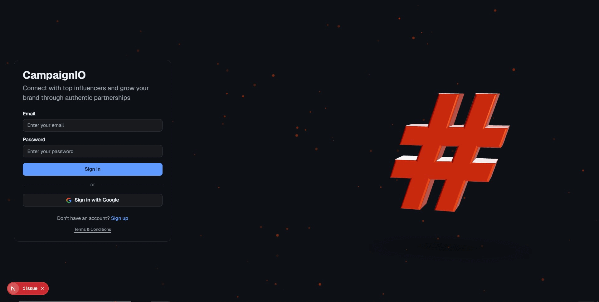

## CampaignIO – Influencer Discovery & Outreach (Full‑Stack)



CampaignIO is a full‑stack app that helps you discover relevant Instagram creators from a product idea or hashtag and manage outreach in one place. It streams recommendations in real‑time (so you don't wait for long scrapes), preserves your search history, and gives you a workspace with Timeline, Notes, Events, Tasks, Deals, Campaigns, Messages, History, and Todo.

I built this to feel fast and forgiving: searches start immediately, results show up incrementally, and you can click around without breaking a long‑running discovery job in the background.

### Highlights
- Real‑time, incremental influencer recommendations (no long blocking waits)
- Background discovery continues even if you navigate away
- Search History saved to both client cache and MongoDB for reliability
- Dynamic profile pages with quick links to social profiles
- Full CRUD on profile workspace tabs (Timeline, Notes, Events, Tasks, Deals, Campaigns, Messages, History, Todo)
- Modern dark/light themes tuned for low glare

---

## How it Works (Conceptually)

1) You enter a product idea and hashtags on the Home page.
2) The app kicks off a background discovery job. A lightweight Node worker (using Puppeteer + stealth) extracts Instagram usernames from permalinks and feeds them back one by one.
3) For each username found, the backend fetches public data and streams results to the frontend incrementally. You see the first suggestion almost immediately, while the rest keep coming in.
4) Results are written to MongoDB and also cached client‑side. That means:
   - If you reload or move around, you won't lose context.
   - If you return later, your History is still there.
5) The Profile workspace gives you a CRM‑like place to organize outreach: you can create, edit, and delete entries across Timeline, Notes, Events, Tasks, Deals, Campaigns, Messages, History, and Todo.

---

## Project Structure

- `app/` – Next.js 13+ frontend (App Router) with pages for Home and Profile
- `backend/` – Flask backend with async discovery worker (spawns Node script)
- `backend/node_username_extractor.js` – Puppeteer worker that extracts IG usernames from permalinks (stealth)
- `backend/database.py` – Centralized MongoDB connection and helpers
- `backend/blueprints/history.py` – Search history storage & access
- `app/api/...` – Next.js API routes that proxy to the backend for the frontend
- `app/home/user/profile/page.tsx` – Workspace UI (Timeline/Notes/Events/...)
- `app/profile/[username]/page.tsx` – Dynamic influencer profiles
- `globals.css` – Theme tokens for light/dark

---

## Tech Stack

- Frontend: Next.js (React), TypeScript
- Backend: Flask (Python)
- Worker: Node.js + Puppeteer (stealth plugin)
- Database: MongoDB Atlas
- Auth: Email/Password + Google OAuth (stored in MongoDB)

---

## Credentials You’ll Need (How to get them)

You do NOT need to paste any private keys into this README. Put them into the backend `config.json` (explained below). Here’s what to obtain and where:

- MongoDB Atlas
  - Create a free cluster (M0) at MongoDB Atlas.
  - Create a database user (read/write).
  - Allow network access for your deploy region or 0.0.0.0/0 for quick start.
  - Copy your connection string (mongodb+srv://...)

- Instagram/Meta (for reading public creator data)
  - Use a long‑lived access token / system user token with appropriate permissions for the Instagram Graph API.
  - Keep your `ig_user_id` and long‑lived access token handy.

- Google OAuth (optional login)
  - Create a Web OAuth client in Google Cloud Console.
  - Add authorized redirect URI pointing to your backend’s `/google-callback` path.
  - Download the JSON and keep it ready.

---

## Configuration

All sensitive values live in `backend/config.json` (not committed). Example keys the app expects:

- `mongodb_uri` – Your MongoDB Atlas connection string
- `mongodb_db` – Database name (e.g., "CampaignIO_DB")
- `app_secret_key` – Any strong random string for Flask sessions
- `ig_user_id` – Instagram Business/Creator user id
- `instagram_access_token` (or `long_access_token`) – Long‑lived token
- `google_client_config` – The Google OAuth JSON payload (with correct redirect URIs)

In production (Render), add this as a Secret File at the path `backend/config.json`.

---

## Local Development

1) Install frontend deps
```bash
cd "v0 integrated"
npm install
```

2) Backend Python deps
```bash
cd backend
pip install -r requirements.txt
```

3) Provide secrets
- Create `v0 integrated/backend/config.json` with your local credentials (see Configuration).

4) Run locally
- Backend: `python app.py` (default port 8000)
- Frontend: from `v0 integrated/`, `npm run dev` (default port 3000)

The frontend proxies through its Next.js API routes to talk to the backend. Discovery jobs run asynchronously in the backend and stream results as they’re processed.

---

## Deployment (Render – single container)

This repo includes a top‑level Dockerfile and start script inside `v0 integrated/` so Render can run both backend and frontend in one service.

Steps:
1) Push to GitHub.
2) In Render → New → Web Service → connect your repo.
3) Set root directory to `v0 integrated` and choose Docker (Render auto‑detects the Dockerfile).
4) Add a Secret File at `backend/config.json` with your production credentials.
5) Deploy.

Render provides the public URL for your app (frontend) and runs the Flask backend inside the same container. The backend listens on port 8000 internally; the Next.js server listens on `$PORT` (Render sets it).

---

## Data Flow (End‑to‑End)

- You search for a hashtag → frontend asks backend to start discovery.
- Backend launches the Node worker to extract usernames from permalinks (stealth Puppeteer).
- As usernames arrive, backend fetches creator info and updates the job state.
- Frontend polls job status via its API routes and renders incoming creators immediately.
- Results are saved to MongoDB and also cached client‑side (for snappy UX and resilience).
- You can navigate to profile pages or other tabs; the background job keeps running.

---

## Theming

- Dark theme uses deep slate/indigo + cyan accents with clear, darkened container edges.
- Light theme is multi‑accent with low glare and stronger borders for definition.
- Layout remains unchanged; only tokens are tuned for readability.

---

## Troubleshooting

- "It takes a while to show results": first result should pop in quickly as soon as a username is found. Cold starts (especially on free tiers) can add a few seconds.
- "History looks empty": ensure both client cache and MongoDB are accessible; check that the backend has valid credentials and can reach Atlas.
- "Auth failing locally": if you use Google OAuth, confirm the local redirect URI matches in Google Cloud and in your `config.json`.
- "Puppeteer errors on Render": the container installs Chromium dependencies. If sandbox issues appear, the worker already uses `--no-sandbox`/stealth.

---

## What’s Not in This README

I intentionally haven’t listed internal API endpoints. You don’t need them to run the app or deploy it. The frontend already talks to the backend via proxy routes, and the backend exposes everything the UI needs.

If you want to explore or extend the APIs later, check the backend blueprints and the Next.js API route code.

---

## Contributing / Extending

- Add new tabs or fields in the Profile workspace as needed.
- Extend the discovery worker for other platforms (TikTok, YouTube) by following the same async pattern.
- Improve ranking/quality by plugging in your own heuristics or ML.

---

## License

Private project. All rights reserved.
